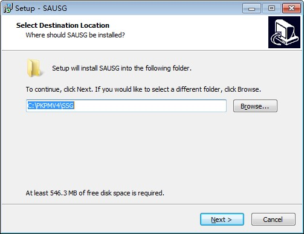
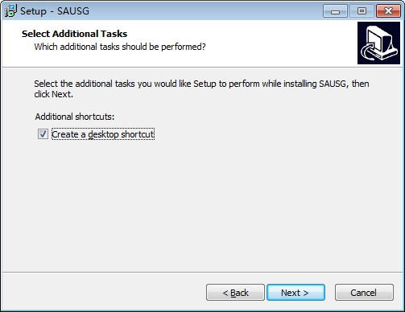
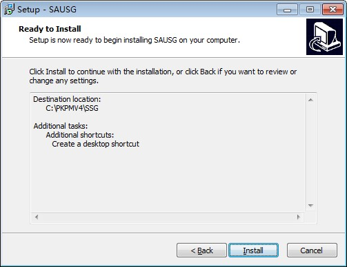

### 1.1	如何安装SAUSAGE软件？
---

首先，下载所需要的的软件版本，可参考 [1.4.软件安装包及补丁下载](1.4.软件安装包及补丁下载.md)。

双击setup.exe进行安装，在弹出的对话框中，采用默认路径或者输入新的路径（Win10系统建议不要安装在系统盘），确认后点击“Next”按钮进入下一步操作。
 

选择是否要在桌面生成程序的快捷方式。确认后点击“Next”按钮进入下一步操作。
 

点击“Install”按钮，开始进行安装。
 

点击“Finish”按钮，结束安装。
 

---
