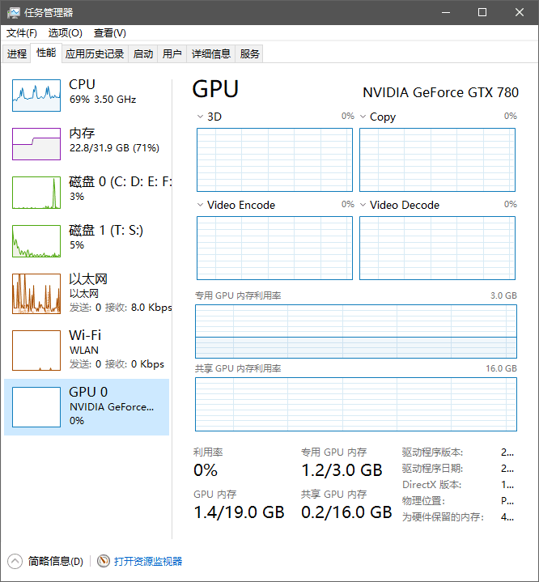
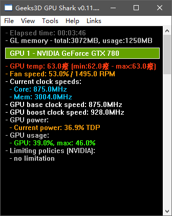

### 1.10 采用显卡计算GPU利用率很低是怎么回事?
---

计算过程中采用任务管理器查看设备实用率发现GPU利用率很低.

这是因为任务管理器默认显示的是3D引擎的利用率，当我们在进行图形操作时可以发现GPU利用率显著提高。而高性能计算的的利用率是无法体现出来的（可能是Windows的bug）.

如果我们要检测高性能计算时GPU的利用情况可以下载应用程序**GPU-Z**或**GPU Shark**进行检测.

---