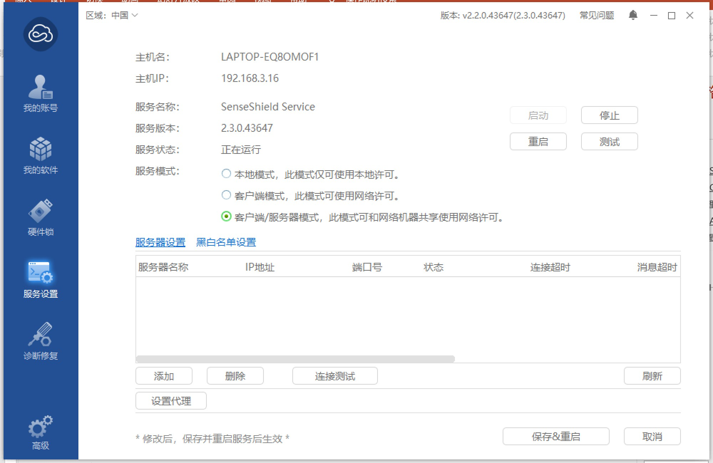
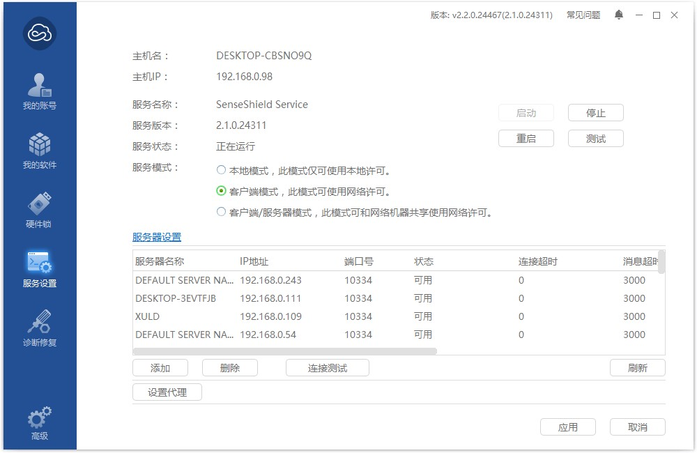
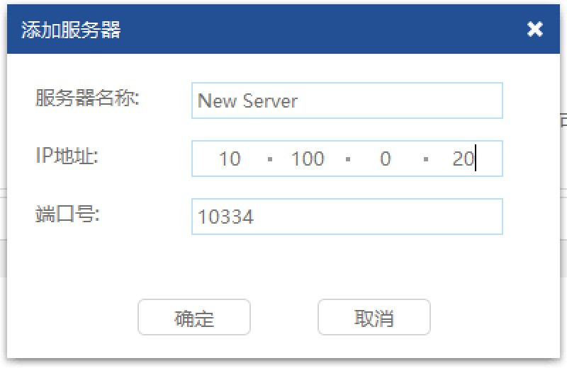

### 1.7 硬件锁应该如何设置？
---

如果为网络锁，在客户端和服务器上都要安装锁驱动程序。打开virbox用户工具，选择“服务设置”，并将服务模式切换到“客户端/服务器模式”。
 

客户端电脑上打开virbox用户工具，选择“服务设置”，并将服务模式切换到“客户端模式”。点击服务器设置下方的“添加”按钮，在弹出的如图 1 8所示对话框中，输入服务器的IP地址，端口号可以设置为“10334”或“10335”。
 

 

---