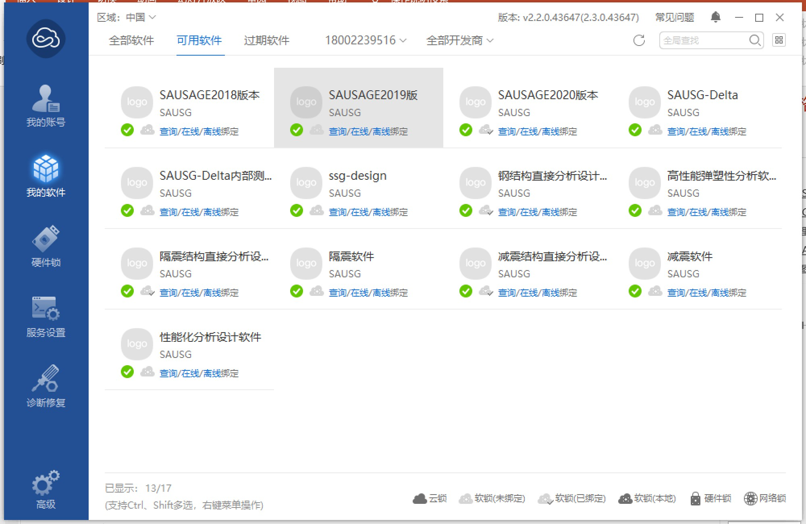
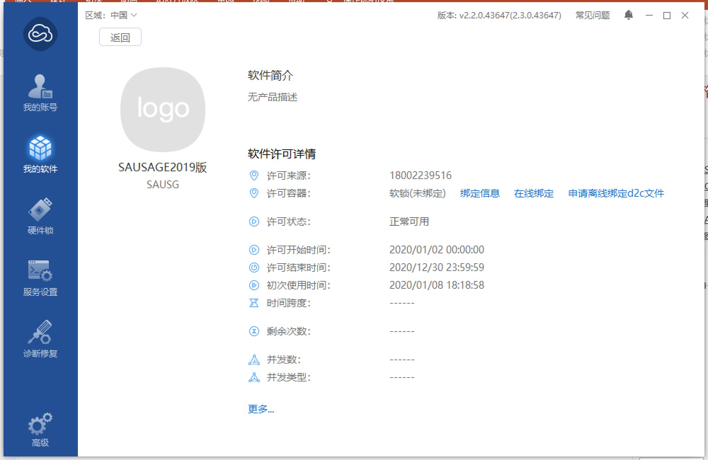
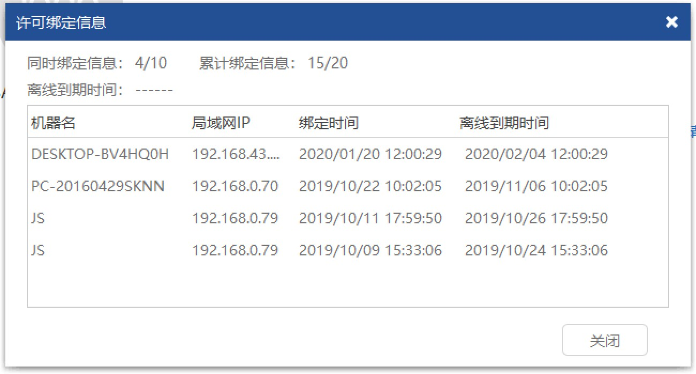

### 1.8 提示未发现授权,是何原因?
---

首先确认您单位的锁为软锁还是硬锁，并按照第[1.6节](1.6.授权文件如何使用.md)和[1.7节](1.7.硬件锁应该如何设置.md)中所述方法进行设置。如果仍提示“未发现授权”，可能为如下原因：

**软锁情况：**

（1）未安装用户锁驱动程序，在桌面找不到virbox用户工具图标。在SAUSG安装文件夹（例如C:\Program Files\SAUSG\ KeyDriver）找到如下文件sense_shield_installer_pub_2.2.0.43647.exe，该文件即为SAUSG锁驱动程序，双击进行安装。
（2）用户许可工具中，选择“我的软件”，单击相应软件后，在弹出的软件详细信息中，查看许可结束时间，确认锁仍处于有效使用期间以内。
 

 

（3）点击“绑定信息”，查看该许可绑定信息，如果绑定机器数或者累计绑定机器数已经达到上限，授权也无法使用。需要将不使用的电脑进行解绑。
 

**硬锁情况：**

（1）检查服务器状态是否为“可用”状态。如果为不可用，需要检查服务器IP输入是否正确。
（2）确认服务器端口号输入为10334或10335。
（3）检查连接是否超时，如果连接超时，需要跟网络管理员确认是否对网络端口进行了限制。确保本机和服务器防火墙入站和出站规则都未禁用10334和10335两个端口号。

---