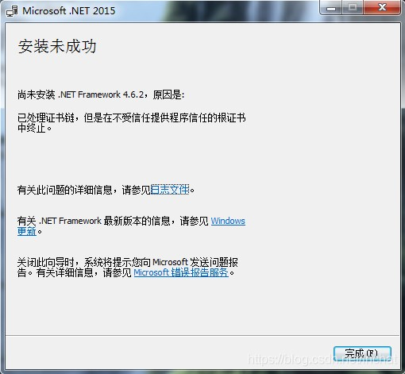
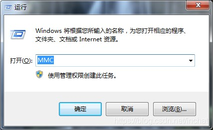
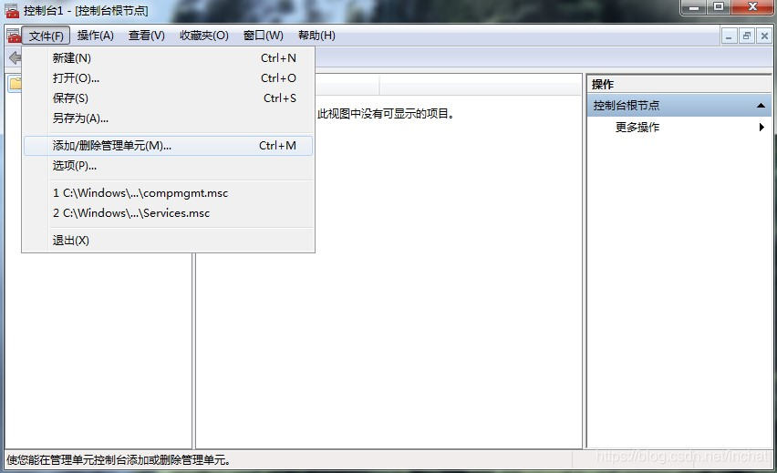
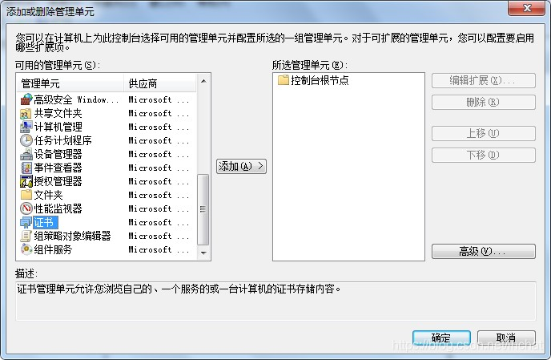
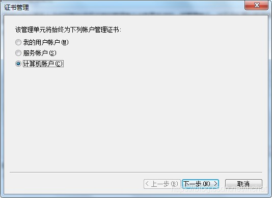

### 1.9 netFramework安装不上如何解决?
---

**已处理证书链,但是在不受信任提供程序信任的根证书中终止 - Windows 7安装.Net Framework 4.6.2时出现此问题**

在全新安装 Windows 7 SP1 后，通过离线包安装 .Net Framework 4.6.2时，遇到错误提示：已处理证书链，但是在不受信任提供程序信任的根证书中终止。

原因是计算机中没有相应的受信任证书，通过导入微软的证书，成功解决此问题。文末附安装包下载链接。

1.点击链接下载微软证书：http://download.microsoft.com/download/2/4/8/248D8A62-FCCD-475C-85E7-6ED59520FC0F/MicrosoftRootCertificateAuthority2011.cer

2.按 Windows徽标键+R 打开运行，输入MMC

3.打开控制台，文件→添加/删除管理单元 (Ctrl+M)

4.选择证书 → 添加 → 计算机账户（其他的保持默认，一直下一步）

5.回到控制台主窗口，依次展开：证书 → 受信任的根证书颁发机构 → 证书，单击更多操作的小箭头，选择所有任务 → 导入；接下来选择步骤1中下载好的cer证书文件，然后一直点击下一步，导入成功即可。

 
6.此时重新安装 .Net Framework 4.6.2 则不会提示问题了。

[.Net Framework 4.6.2 离线安装包](https://www.lanzous.com/i9aitef)
[.Net Framework 4.6.2 在线安装包](https://www.lanzous.com/i9aitja)

---