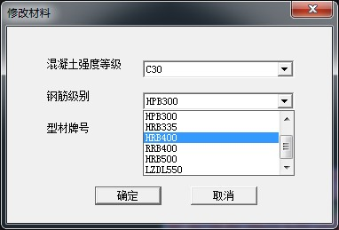

### 2.6  程序会自动读取楼板钢筋为HPB300，但常规设计都是采用HRB400，需要导入后对参数进行修改，如何能自动导入楼板钢筋等级为HRB400。

---

由于SATWE中没有楼板设计信息，SAUSAGE软件在导入SATWE模型时无法读取到楼板信息。

* 在SAUSAGE2017以前版本中，软件读入时会统一设置为HPB300。可以批量选择楼板，然后修改楼板材料中的钢筋级别（属性→板→材料）。

* 在SAUSAGE2018版本中，考虑到实际工程中HRB400大量采用，将默认楼板钢筋统一修改为HRB400。

---
