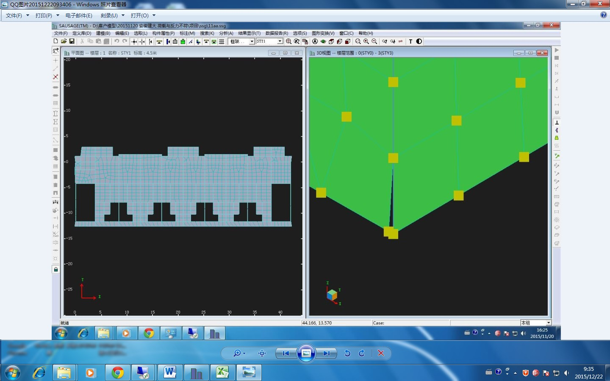

### 5.6	问题：竖向荷载加载分析提示“反力与外荷载不一致”，是何原因？
---

出现“反力与外荷载不一致”提示可能有如下两种情况：
* 一是由于结构存在非base层的约束导致，用户可检查模型约束条件是否正确，如果结构其他楼层有不必要的节点约束，用户可手动取消这些约束。
如果结构必须要进行非base层的约束，在保证约束条件正确的情况下可以忽略该提示。
* 二是由于模型异常或网格畸形导致，如下所示。由于模型中存在距离很近的两个节点，导致两片剪力墙空间上分开。利用菜单“编辑”→“移动点”，将其中一个节点移至与第二个点重合后，竖向加载分析正常。

---
