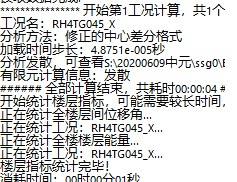
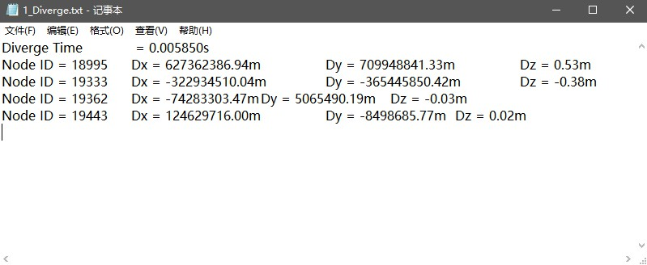
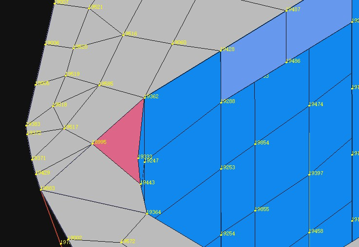
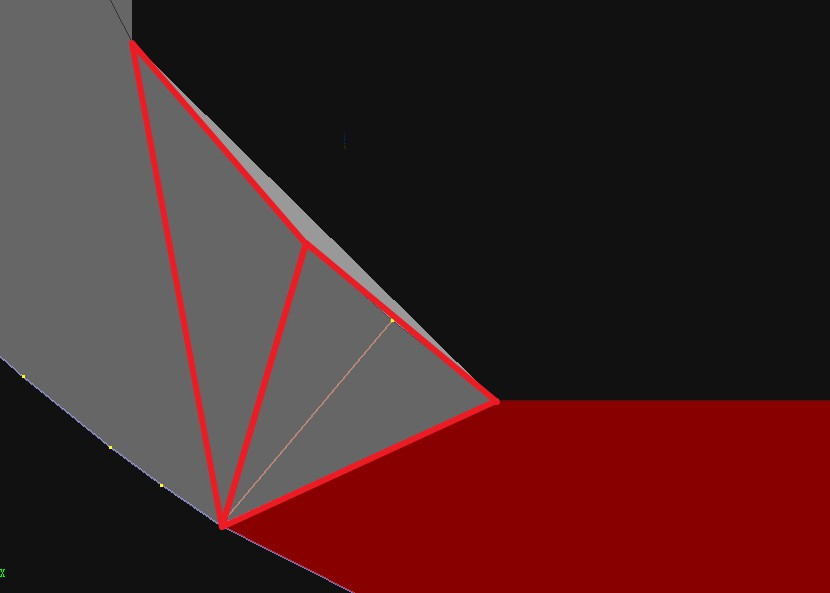
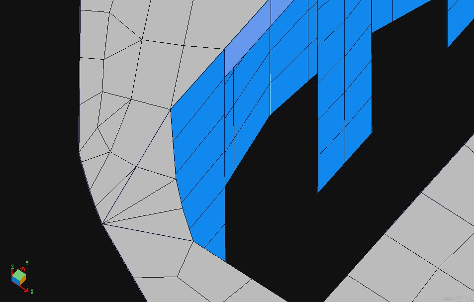
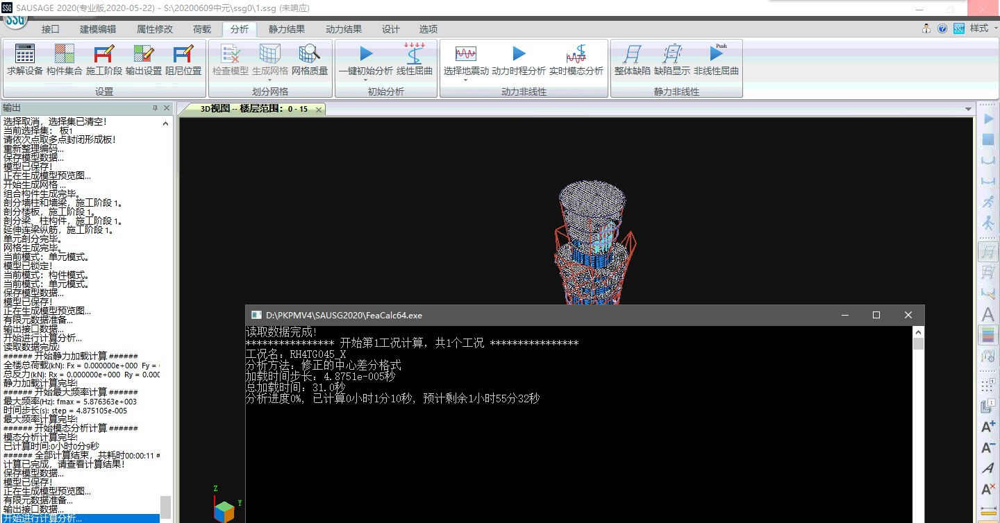

### 案例1
---

凹多边形网格导致的发散

**存在问题：** 某模型，采用中心差分法进行弹塑性时程分析，提示计算发散

查看发散文件Diverge.txt，提示有四个节点号：

定位节点位置，发现是一凹形四边形单元导致：

**处理方法：** 将对应楼板删除，在形成凹点除分成两块楼板进行建模

重新进行网格划分，对应位置均为三角形网格，不会再出现凹四边形网格。

提交计算正常。

---
