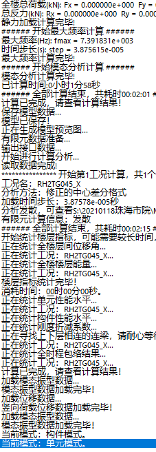

### 案例3
---

凹多边形网格导致的发散

**存在问题：** 

某模型，采用中心差分法进行弹塑性时程分析，提示计算发散

**检查方法：**

查看发散文件Diverge.txt，发现提示节点数很多，位移均为-1.#Jm，输出当前输出步错过了原始异常节点号，需要手动调整输出间隔。

依次点击【分析】→【输出设置】，在“分析输出设置”对话框中，将结果输出间隔调整为显示加载步长，重新提交计算。

计算发散后打开Diverge.txt文件，文件中提示了发散节点号：

对提示节点号进行定位，依次点击【属性修改】→【搜索】，类型选择“单元”，输入节点号定位：

对应节点号位置，模型存在凹多边形

**处理方法：** 

通过移动节点，将楼板形状改成正常形状，重新进行计算，可以正常进行。

* 注意：分析正常后将模型输出间隔改为正常值

---
