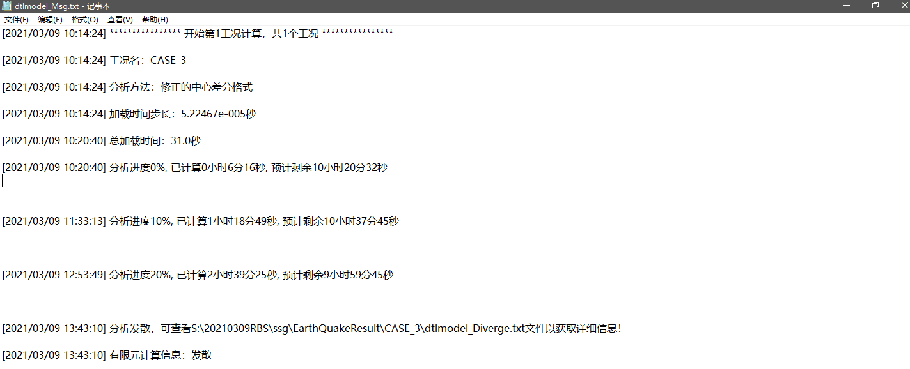
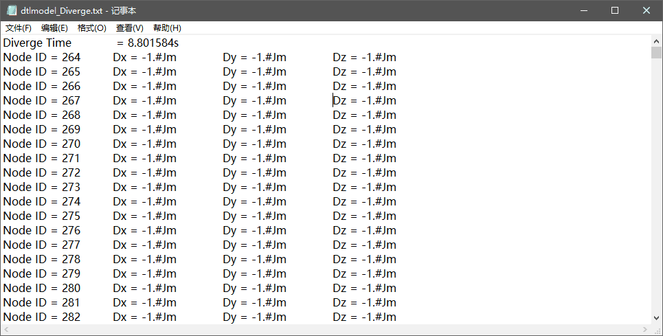
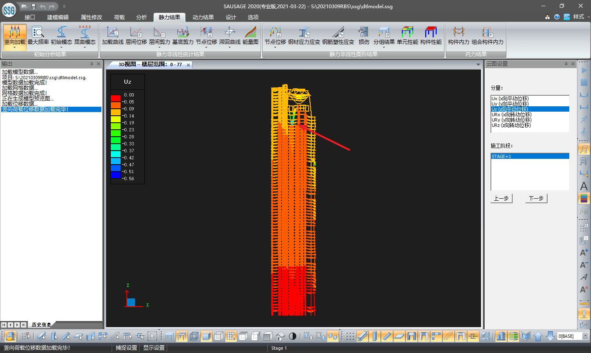
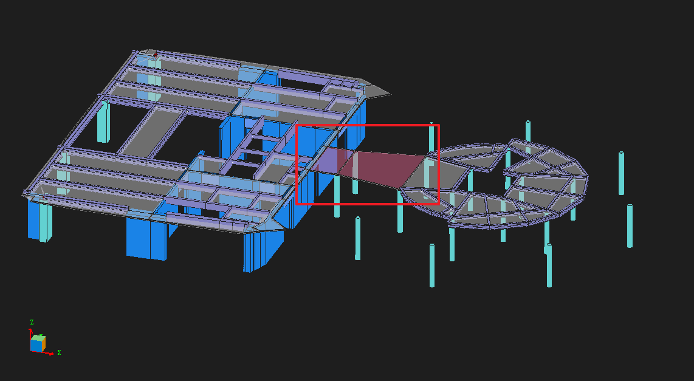
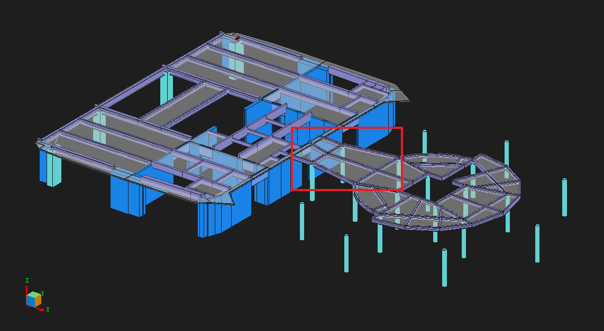
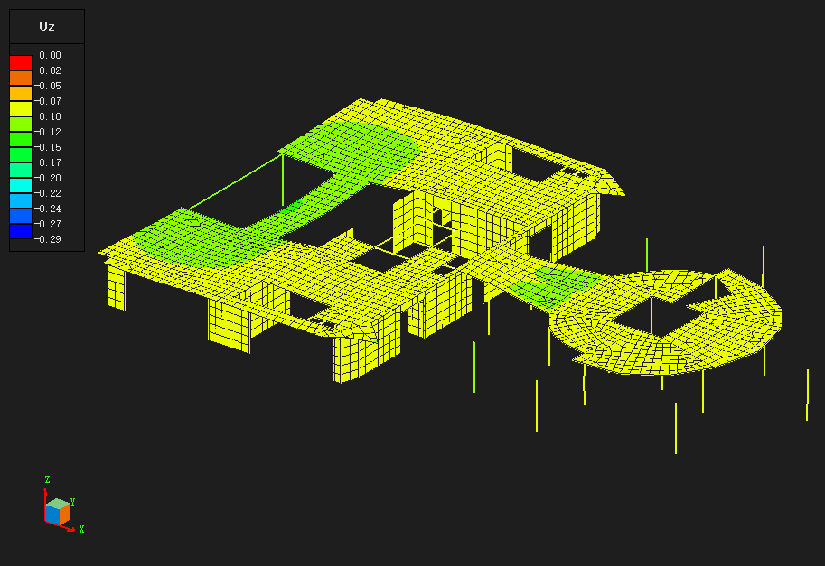

### 案例4
---

建模错误导致的发散

**存在问题：** 

某模型，采用中心差分法进行弹塑性时程分析，计算过程中出现计算发散。检查Msg文件如下图所示：

根据提示，查看Diverge文件，发散节点号较多，不易检查发散节点：

若这种情况，我们可以按照 [案例3](案例3.md) 的方法通过修改输出步长确定发散位置，但是如果模型较大，需要花费较长的计算时间。

我们也可以通过检查模型建模问题的方法确定问题。

**检查方法：**

检查模型静力分析变形情况（包括竖向加载变形和初始模态变形），**变形明显较大的位置很有可能是导致发散的部位**。

竖向加载变形：【静力结果】→【竖向加载】

初始模态变形：【静力结果】→【初始模态】

对于本案例，我们查看竖向加载变形情况，如下图所示：

可以发现图示位置构件竖向变形明显较大，进一步查看模型，变形较大的楼板缺少框架梁支撑，同时楼板跨度较大导致静力变形异常，如下图所示：

**处理方法：** 

将模型正确建模，重新计算即可：

---
