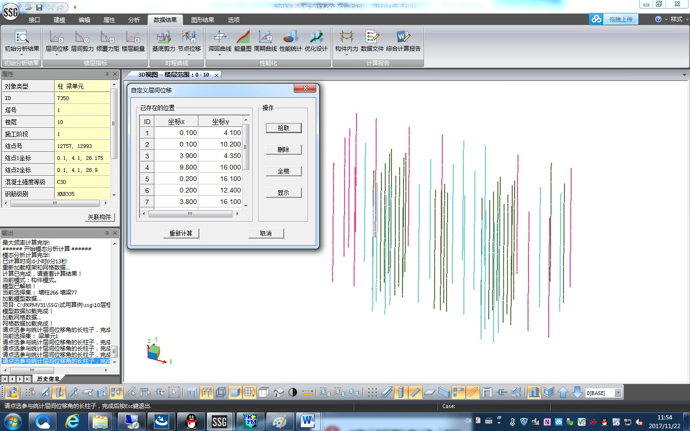

### 8.8	问题：如何自定义位置计算层间位移角？
---

数据结果→层间位移→自定义层间位移
用鼠标左键，单击任意一个框架柱或剪力墙边缘构件，则该构件的水平坐标（坐标X和坐标Y）将会增加到左侧列表中。同时采用该坐标的所有框架柱和剪力墙边缘构件将会被选中，视图中将显示为红色。点击“重新计算”，程序将利用这些构件，按照8.3节中所述方法，计算层间位移角。
自定义层间位移角的结果可以通过菜单“数据结果→层间位移→层间位移”进行查看。数据分组中选择自定义，则可以查看自定义的层间位移角。

---
