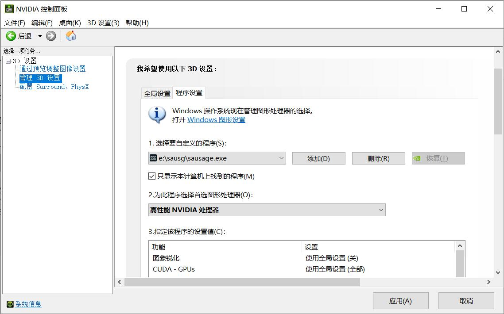
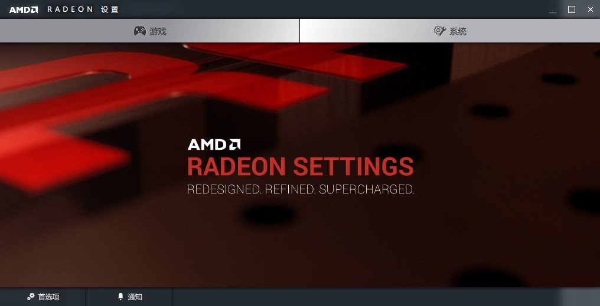
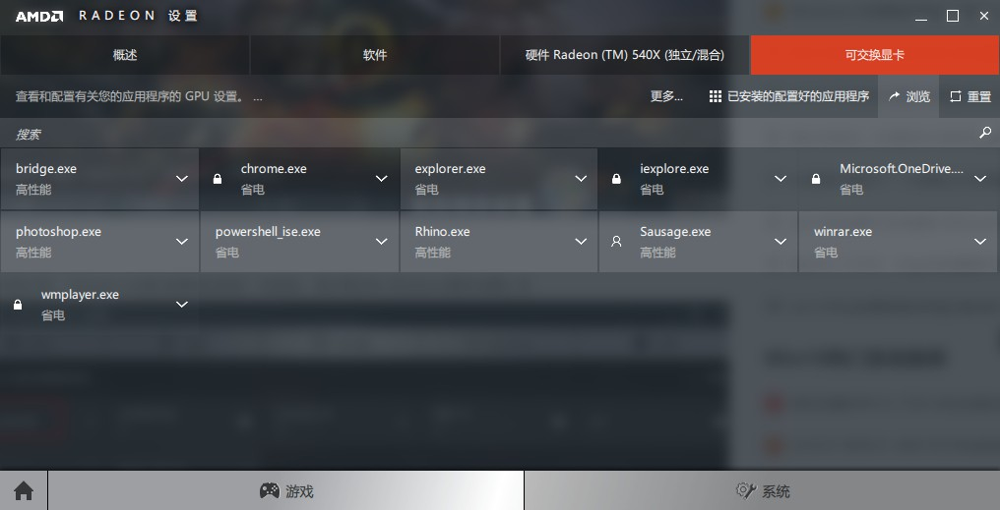

### 9.9  建模中（捕捉节点）软件崩溃怎么办？
---

一般是由于当前显卡性能过低或采用集成显卡导致。

若计算机有独立显卡，可选择采用独立显卡进行图形显示。

##### NVIDIA显卡

* 打开NVIDIA控制面板

* 将NVIDIA处理器设置为sausage.exe的首选图形处理器。

##### AMD显卡

* 打开AMD RADEON设置面板

* 点击【系统】→【可交换显卡】→【运行中的应用程序】→【已安装的配置好的应用程序】→【浏览】

* 在软件安装路径中选择sausage.exe。

若计算机没有独立显卡，请升级计算机配置或更换机器。

---
